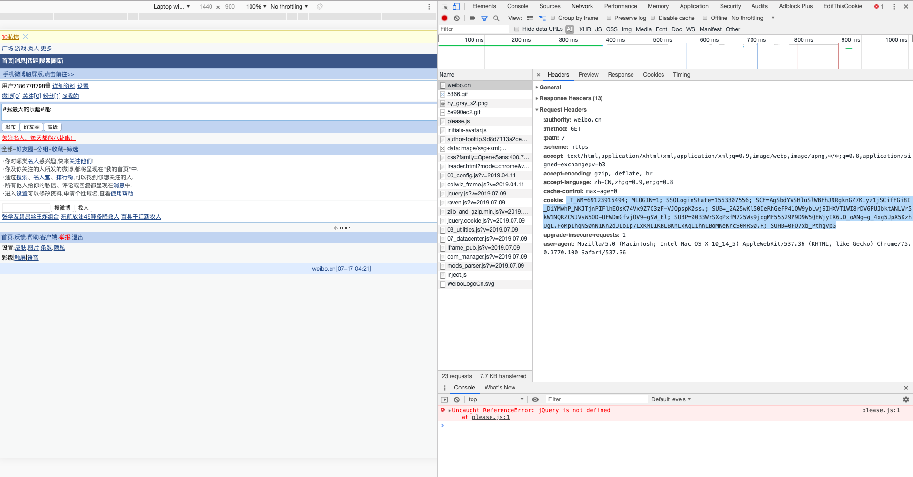
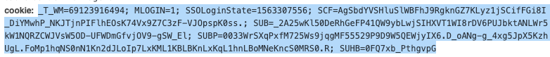
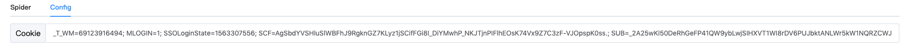

# WebCrawler

```shell
pip install -r requirement.txt
python manage.py runserver 0.0.0.0:9000 --insecure
```
## 获取Cookie
账号：kzmiasvlxaeop-vk08479@yahoo.com
密码：Tqymwurb5
网址：weibo.cn
在Chrome上用该测试账号或其他任何微博账号登陆后，右键单击检查，弹出控制台后点击Network标签页，刷新weibo.cn，查看Network标签页下Name为weibo.cn的Headers中的cookie项，将其复制下来粘贴进入网站的Cookie项中，然后切换回Spider标签页，点击开始抓取







